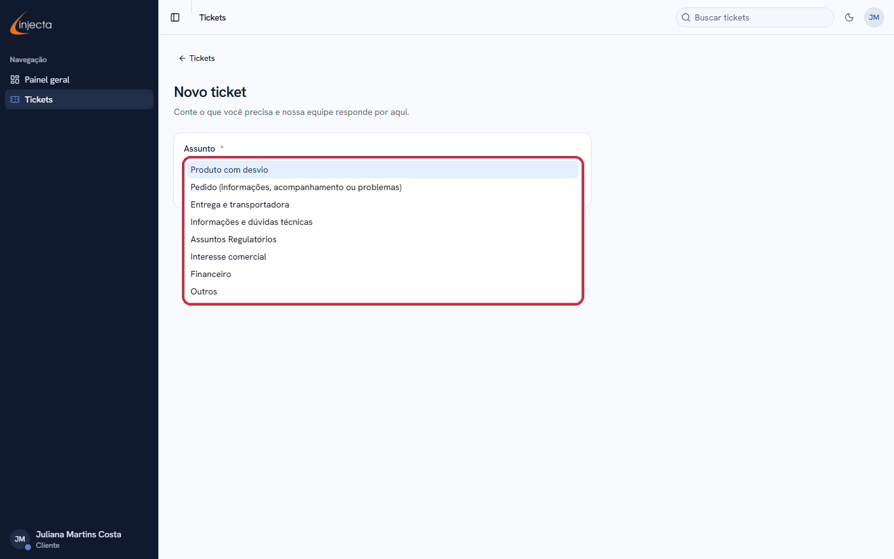
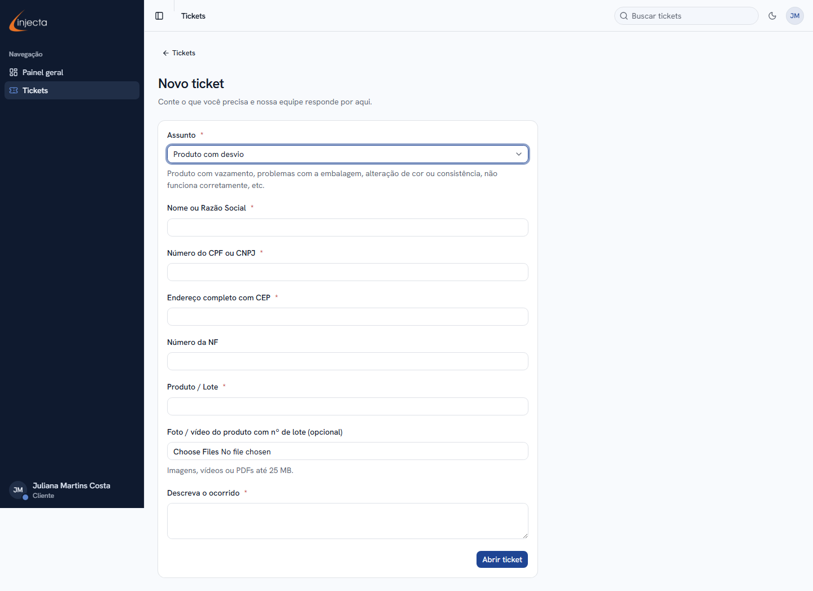
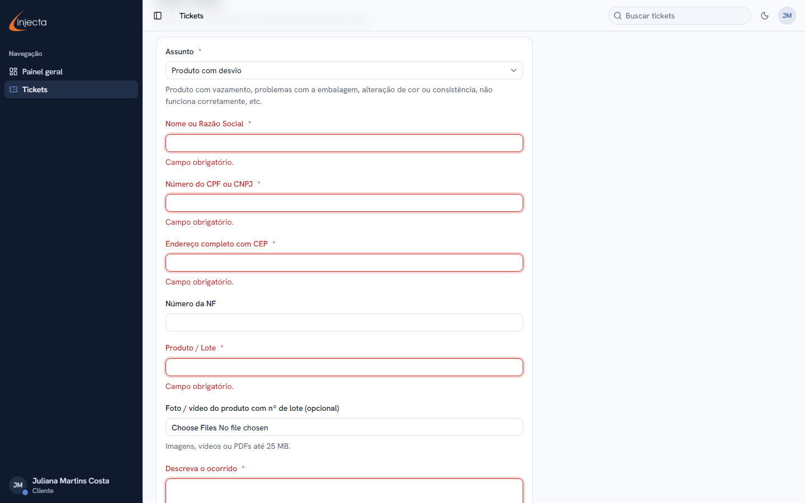
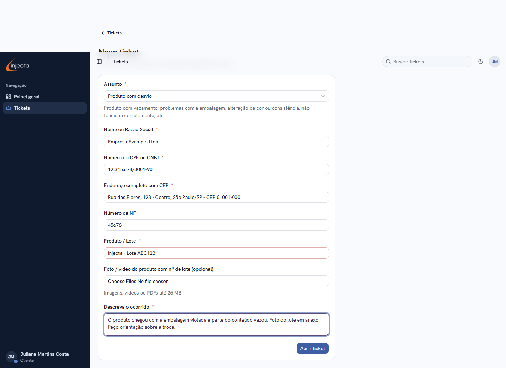
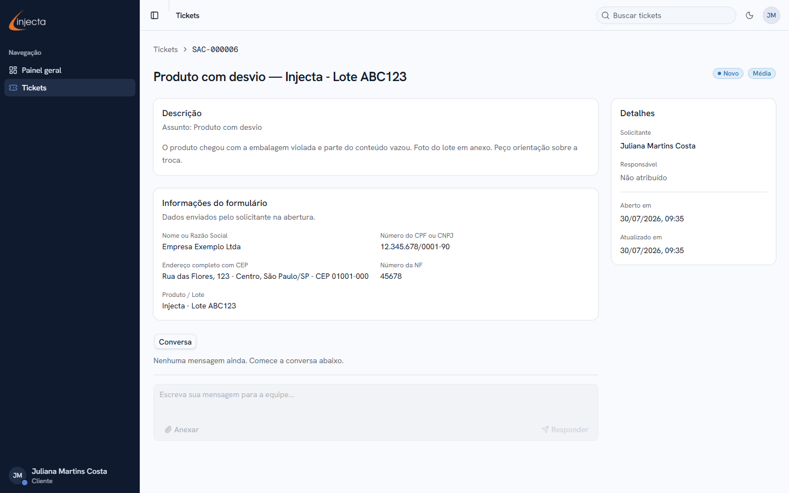
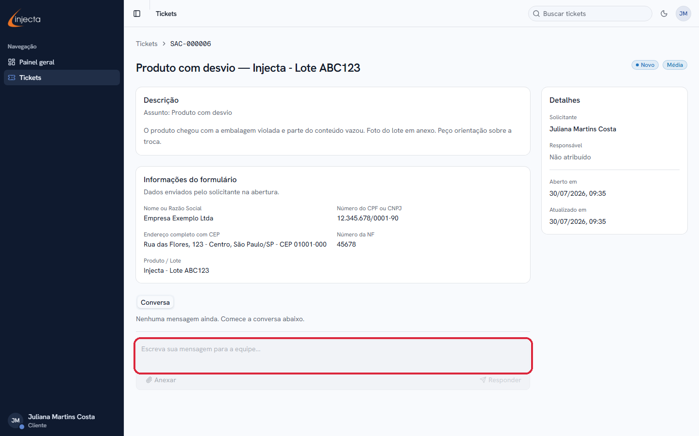
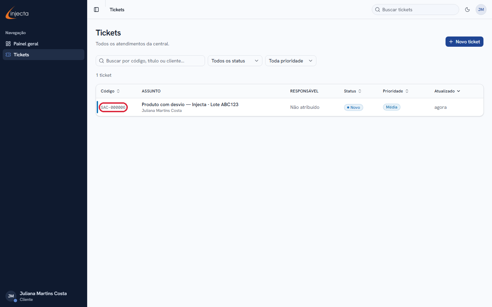

# Como abrir um ticket na Central de Atendimento

Este guia mostra, passo a passo, como **abrir um ticket** (solicitação de atendimento) e **conversar com a equipe** da Injecta até a solução do seu caso.

> **Antes de começar:**
>
> - Você precisa de uma conta na central. Se ainda não tem, veja o guia **“Como criar a sua conta”**;
> - Acesse `sac.injecta.com.br` e entre com seu e-mail e senha.

---

## Passo 1 — Clique em “+ Abrir ticket”

Assim que você entra, o painel mostra a saudação com o seu nome. Clique no botão azul **“+ Abrir ticket”**, no canto superior direito (destacado na imagem):

> 💡 Esse mesmo botão também aparece como **“+ Novo ticket”** na tela “Tickets” do menu lateral. Os dois levam ao mesmo lugar.

---

## Passo 2 — Escolha o assunto

A primeira pergunta é: **sobre o que é a sua solicitação?** Clique na caixa **“Assunto”** e escolha a opção que mais combina com o seu caso:

| Assunto | Quando escolher |
|---|---|
| **Produto com desvio** | Vazamento, problema na embalagem, alteração de cor ou consistência, produto que não funciona corretamente. |
| **Pedido (informações, acompanhamento ou problemas)** | Dúvidas sobre um pedido, acompanhamento do andamento, quantidade diferente do pedido ou da NF, cancelamento. |
| **Entrega e transportadora** | Produto trocado, avaria no transporte, atraso na entrega, roubo de carga. |
| **Informações e dúvidas técnicas** | Perguntas sobre uso, indicação e características dos produtos. |
| **Assuntos Regulatórios** | Certificados, registros, documentação regulatória. |
| **Interesse comercial** | Quer comprar, revender ou conhecer condições comerciais. |
| **Financeiro** | Boletos, pagamentos, notas fiscais, cobranças. |
| **Outros** | Qualquer caso que não se encaixe nos anteriores. |

> Não se preocupe em errar: escolha a opção mais próxima e explique tudo na descrição. A equipe direciona o ticket internamente.

---

## Passo 3 — Preencha os campos

Ao escolher o assunto, o formulário mostra os campos daquele tipo de solicitação. Os campos marcados com **asterisco vermelho ( * ) são obrigatórios**. Veja o exemplo do assunto “Produto com desvio”:

| Campo | O que preencher |
|---|---|
| **Nome ou Razão Social** * | Seu nome ou o nome da sua empresa, como está na nota fiscal. |
| **Número do CPF ou CNPJ** * | O documento de quem comprou o produto. |
| **Endereço completo com CEP** * | Rua, número, bairro, cidade/UF e CEP. |
| **Número da NF** | O número da nota fiscal da compra, se tiver em mãos (não é obrigatório). |
| **Produto / Lote** * | O nome do produto e o número do lote (o lote está impresso na embalagem). |
| **Foto / vídeo do produto** | Anexe fotos ou vídeos que mostrem o problema **e o nº de lote**. Aceita imagens, vídeos e PDFs de até 25 MB. |
| **Descreva o ocorrido** * | Conte com suas palavras o que aconteceu: o que você percebeu, quando e como. Quanto mais detalhes, mais rápido o atendimento. |

> 💡 **Os campos mudam conforme o assunto.** Por exemplo, “Entrega e transportadora” pede o nome da transportadora em vez do endereço, e em **“Assuntos Regulatórios” o campo “Produto / Lote” é opcional** (não tem asterisco) — preencha só se fizer sentido para o seu pedido. É só seguir o que a tela pedir.

---

## Passo 4 — Campos obrigatórios não podem ficar vazios

Se você clicar em “Abrir ticket” sem preencher algum campo obrigatório, o sistema mostra o aviso **“Campo obrigatório.”** em vermelho, logo abaixo do campo que falta. Nada é perdido — preencha o que falta e clique de novo:

---

## Passo 5 — Confira e envie

Com tudo preenchido, revise as informações e clique no botão azul **“Abrir ticket”**. Veja um exemplo de formulário completo:

---

## Passo 6 — Ticket aberto! Guarde o código

Pronto — o ticket foi criado e você já é levado para a página dele. Repare em três informações importantes:

- **Código do ticket** (ex.: `SAC-000006`): é o número do seu atendimento. Use-o se precisar mencionar o caso;
- **Status** (ex.: `Novo`): mostra em que etapa o atendimento está — veja a tabela abaixo;
- **Detalhes** (coluna da direita): mostra o solicitante, o responsável e as datas de abertura e atualização.

| Status | O que significa |
|---|---|
| **Novo** | Seu ticket foi recebido e aguarda a triagem da equipe. |
| **Em atendimento** | A equipe está analisando o seu caso. |
| **Aguardando cliente** | **A equipe precisa de uma resposta sua** — abra o ticket e responda na conversa. |
| **Fechado** | O atendimento foi encerrado. |

---

## Passo 7 — Converse com a equipe pelo próprio ticket

Toda a comunicação acontece na área **“Conversa”**, na parte de baixo da página do ticket. Escreva sua mensagem na caixa de texto e clique em **“Responder”**. Para enviar mais fotos ou documentos, use o botão **“Anexar”**:

> 💡 Sempre que a equipe responder, o status e a data de atualização mudam, e você vê o **nome do atendente** que te respondeu. Se o status estiver **“Aguardando cliente”**, é a sua vez de responder.

---

## Passo 8 — Acompanhe seus tickets

Para ver todos os seus atendimentos, clique em **“Tickets”** no menu lateral esquerdo. A lista mostra o código, o assunto, o status e a última atualização de cada ticket — clique em qualquer linha para abrir os detalhes:

Você também pode **buscar** por código ou título e **filtrar** por status e prioridade usando os controles acima da lista.

---

## Perguntas frequentes

**Posso abrir mais de um ticket?**
Sim. Abra um ticket para cada caso diferente — isso agiliza o atendimento. Evite tratar dois problemas distintos no mesmo ticket.

**Esqueci de anexar a foto. E agora?**
Sem problema: abra o ticket na lista, vá até a conversa e envie o arquivo pelo botão **“Anexar”**.

**Como sei que a equipe respondeu?**
Entre na central e veja o painel: o cartão **“Aguardando você”** mostra quantos tickets precisam da sua resposta. Na lista de tickets, a coluna “Atualizado” mostra a última movimentação.

**Abri o ticket com o assunto errado. Preciso abrir outro?**
Não. Explique na conversa — a equipe reclassifica e direciona internamente.

---

*Guia atualizado em julho/2026. As telas podem sofrer pequenas variações visuais conforme o sistema evolui.*
