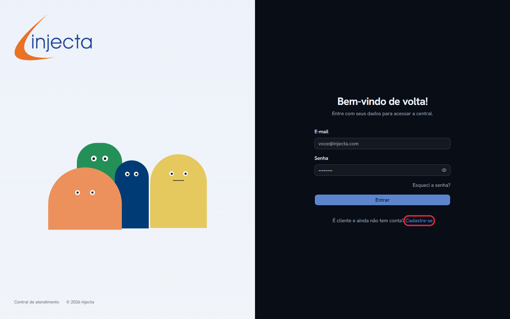
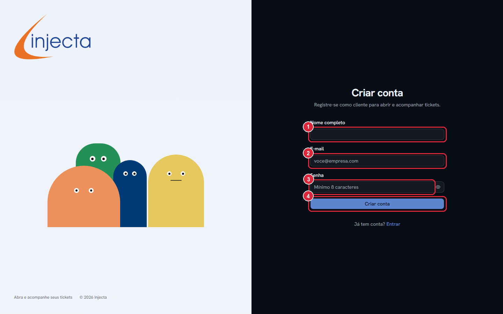
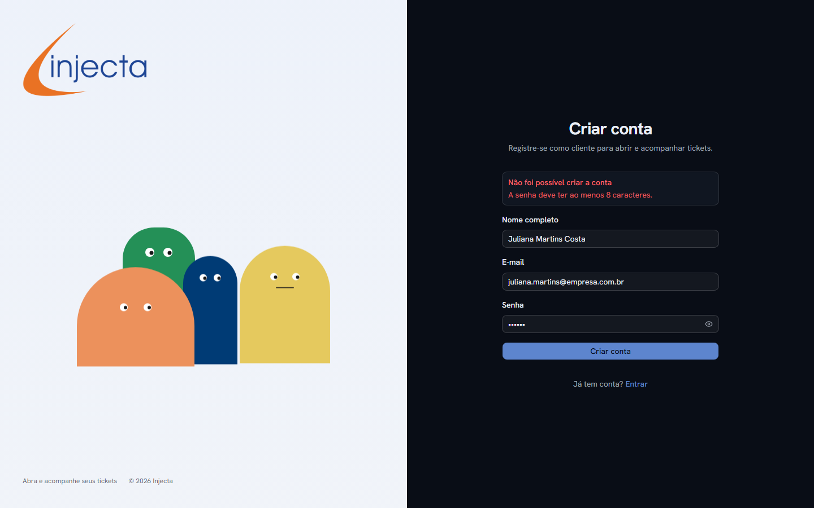
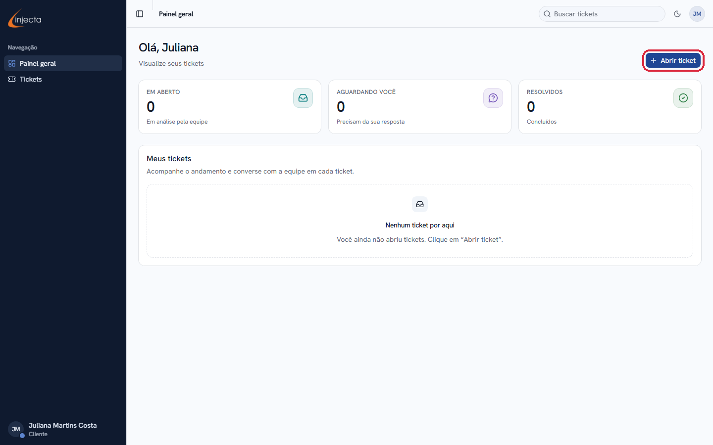

# Como criar a sua conta na Central de Atendimento

Este guia mostra, passo a passo, como criar a sua conta de cliente na Central de Atendimento Injecta. Com a conta você pode **abrir tickets** (solicitações de atendimento) e **acompanhar as respostas da equipe** — tudo em um só lugar.

> **O que você vai precisar:**
>
> - Um e-mail válido que você use no dia a dia;
> - Uma senha de **no mínimo 8 caracteres**, criada por você.
>
> O cadastro leva menos de 2 minutos e é gratuito.

---

## Passo 1 — Acesse a Central de Atendimento

Abra o navegador (Chrome, Edge, Firefox etc.) e acesse o endereço da central:

```
sac.injecta.com.br
```

Você verá a tela de entrada. Como você ainda não tem conta, clique no link **“Cadastre-se”**, destacado em vermelho na imagem abaixo — ele fica logo abaixo do botão azul “Entrar”:



---

## Passo 2 — Conheça a tela de cadastro

Ao clicar em “Cadastre-se”, a tela **“Criar conta”** será exibida. Ela tem apenas 3 campos e 1 botão:



| Nº | Campo | O que preencher |
|----|-------|-----------------|
| **1** | **Nome completo** | Seu nome e sobrenome. É assim que a equipe vai te chamar. Ex.: `Juliana Martins Costa` |
| **2** | **E-mail** | O e-mail que você vai usar para entrar na central. Ex.: `juliana.martins@empresa.com.br` |
| **3** | **Senha** | Uma senha criada por você, com **pelo menos 8 caracteres**. Dica: misture letras maiúsculas, minúsculas e números. Ex.: `JulianaSenha123` |
| **4** | **Botão “Criar conta”** | Clique nele depois de preencher tudo. |

---

## Passo 3 — Preencha os seus dados

Digite seu nome, e-mail e senha. Se quiser **conferir a senha antes de enviar**, clique no ícone de **olho** ao lado do campo (destacado abaixo) — ele mostra e esconde o que você digitou:


> 💡 **Dica:** anote a senha em um lugar seguro ou use uma que você não vá esquecer. Você vai usá-la toda vez que entrar na central.

Quando estiver tudo certo, clique no botão azul **“Criar conta”**.

---

## Passo 4 — Se aparecer uma mensagem de erro, não se preocupe

Se algo estiver fora do padrão, o sistema avisa em um quadro vermelho **acima do formulário** e nada é perdido — basta corrigir e clicar em “Criar conta” de novo. O erro mais comum é a senha curta:



| Mensagem exibida | O que significa | Como resolver |
|---|---|---|
| “A senha deve ter ao menos 8 caracteres.” | A senha digitada é muito curta. | Crie uma senha com 8 caracteres ou mais. |
| “Já existe uma conta com este e-mail.” | Este e-mail já foi cadastrado antes. | Volte à tela de entrada, clique em **“Entrar”** e use sua senha. Se esqueceu a senha, use o link **“Esqueci a senha?”** na tela de login. |
| “Não foi possível criar a conta. Tente novamente.” | Houve uma falha momentânea de conexão. | Aguarde alguns segundos e clique em “Criar conta” novamente. |

---

## Passo 5 — Pronto! Você já está dentro da central

Assim que a conta é criada, você entra **automaticamente** no seu painel — não precisa confirmar nada por e-mail. Você verá a saudação com o seu nome e os contadores dos seus tickets:



A partir daqui:

- Para **fazer uma solicitação**, clique no botão azul **“+ Abrir ticket”** (destacado na imagem), escolha o assunto que mais combina com o seu caso e preencha o formulário;
- Para **acompanhar suas solicitações**, use o menu **“Tickets”** na barra lateral esquerda;
- Seu nome aparece no canto inferior esquerdo, confirmando que você está conectado.

---

## Perguntas frequentes

**Esqueci minha senha. E agora?**
Na tela de entrada, clique em **“Esqueci a senha?”** (logo abaixo do campo Senha) e siga as instruções para criar uma nova.

**Posso usar a mesma conta em mais de um computador ou no celular?**
Sim. Basta acessar o mesmo endereço e entrar com seu e-mail e senha.

**Criei a conta, mas caí na tela de login em vez do painel.**
Sem problema: digite o e-mail e a senha que você acabou de cadastrar e clique em **“Entrar”**.

**Preciso pagar algo?**
Não. A central é um canal gratuito de atendimento aos clientes Injecta.

---

*Guia atualizado em julho/2026. As telas podem sofrer pequenas variações visuais conforme o sistema evolui.*
